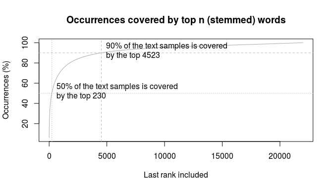

#### Coursera Data Science Specialization Capstone

    # dependencies

    library(knitr)
    library(tm)

    ## Loading required package: NLP

    library(NLP)
    library(readr)

    # also install: filehash

1. Summary
----------

This is an intermediate report on the capstone project, which aims to
create some system that accelerates user input e.g. on mobile devices by
offering options as the next word while the user is typing. I expect
this project to finish with a ground-up prototype of a realistic
predictive engine.

The language the solution works in is up to the student, I expect to
choose the (I assume fairly typical) US English.

This search for a solution cannot aim to be exhaustive -- for instance
using someone else's service is not really an option when demonstrating
skills, however definitely is a possibility in reality.

The two most promising predictive strategies are covered here, namely

-   using a vocabulary to predict words (i.e. predicting while ignoring
    the context)
-   leveraging the knowledge of a preceding word (using bigrams)

As it is also useful to verify/construct hypotheses using a smaller
subset before expanding the scope of discussion, the examinations are
restricted to two word structures, longer ones may be considered at a
later stage.

2. Introducing the data set
---------------------------

For this project, a set of 3 files was
[provided](https://eventing.coursera.org/api/redirectStrict/Nj8snifhv3-FC2rzb11MgOcihhVx3nDwDOW4RX2Q7XQW7AHjp2xRhJK-Zq5FSWRHNbbzJoFzf0jHuBN4KvkLVA.PmAafTLQ4d5DoiLq5_FE0g.U7Pg_6RscXUwxpHwM4N7Ni_nYZwb6D6OEqwt7itM6wnk0xZTvIQCI3HUDhMv1tdgTYk4CWrqeka6qJD_NKelM9zZ6jkwBcBr_ndono6tkz-SxHo4TLk77SAyff12wdnjHKxcEqlp_Tj8GnYoBMxjBFZMZxdEt1pa8m-ll8c83mJYDTCNGHE4qYVBvoQzFvvtDIICjTcrx212Y9L3ghN-JlGbRQjIv_6rLKDzoY1_AQDuGOnQT89M4NmAuqLAwFzos-iUin2ZTAMaSC9CoCr0HcycooFVg0onhR8BJoyLFiMrSY06nsiLcF9vzulvFc6kJ32cFvQae5bMPy9Mhtd1j-YpyK8waf0FkDnlzPXwbnD819qJFRlDGANV86dE9iGNc1xmTr-D7slkf6z59Kg_pi0wST7sn50FZaGUO5lLDn0).
These encompass a large corpus of (US) English words, containing
hundreds of megabytes of data. The sources are summarized below based on
subsamples. Subsampling allows for the processing to take place quickly
despite the sheer size of the data (and R's notoriously bad reputation
at scaling up to large data sets).

For the sake of exploration, numbers and punctuations have been
consistently removed. This may need reconsideration before the final
prototype.

    data.path  = "../../input/en_US/"
    file.names = dir(data.path)
    file.paths = file.path(data.path, file.names)
    sizes = file.size(file.paths)

    # prepare for reproducible random subsampling
    set.seed(0)
    # read up the files
    lines = rep(NA, 3)
    line.counts = rep(NA, 3)
    sample.lines = c(3000, 3000 * 1.05, 9000)
    for(i in 1:3) {
      text = readLines(file.paths[i], -1)
      line.counts[i] = length(text)
      # use a small, random sample of the data as 
      # text manipulation gets slow otherwise
      is.selected = sample(x = length(text), size = sample.lines[i])
      text = text[is.selected]
      # the text will be more useful as a single character
      text = paste0(text, collapse = " ")
      
      lines[i] = text
    }

    ## Warning in readLines(file.paths[i], -1): line 167155 appears to contain an
    ## embedded nul

    ## Warning in readLines(file.paths[i], -1): line 268547 appears to contain an
    ## embedded nul

    ## Warning in readLines(file.paths[i], -1): line 1274086 appears to contain an
    ## embedded nul

    ## Warning in readLines(file.paths[i], -1): line 1759032 appears to contain an
    ## embedded nul

    # prepare for text mining
    corp = Corpus(VectorSource(lines))
    inspect(corp)

    ## <<VCorpus>>
    ## Metadata:  corpus specific: 0, document level (indexed): 0
    ## Content:  documents: 3
    ## 
    ## [[1]]
    ## <<PlainTextDocument>>
    ## Metadata:  7
    ## Content:  chars: 678432
    ## 
    ## [[2]]
    ## <<PlainTextDocument>>
    ## Metadata:  7
    ## Content:  chars: 644799
    ## 
    ## [[3]]
    ## <<PlainTextDocument>>
    ## Metadata:  7
    ## Content:  chars: 627748

    cl.corp = tm_map(corp, stripWhitespace)
    cl.corp = tm_map(cl.corp, content_transformer(tolower))
    cl.corp = tm_map(cl.corp, removePunctuation)
    cl.corp = tm_map(cl.corp, removeNumbers)
    cl.corp = tm_map(cl.corp, stemDocument)
    # currently stopwords are not removed
    # cl.corp = tm_map(cl.corp, removeWords, stopwords("english"))
    dtm = DocumentTermMatrix(cl.corp)

    rm(corp)
    rm(lines)

    full.to.sample = line.counts / sample.lines

    kable(
      caption = "Data set summary table (words are stemmed)",
      align = c("l", "r", "r", "r", "r", "r", "r"),
      col.names = c("File", "File Size (MB)", "Lines (k)", 
                    "Word Count (est. total, k)", "Sampling Ratio", 
                    "Word Count (sample)",
                    "Unique Words (sample)"),
      data.frame(file.names, 
                 round(sizes / 1024 / 1024, digits = 2),
                 round(line.counts / 1000),
                 round(apply(as.matrix(dtm), MARGIN = 1, FUN = sum)
                       * full.to.sample / 1000),
                 sprintf("%.2f %%", 1 / full.to.sample * 100),
                 apply(as.matrix(dtm), MARGIN = 1, FUN = sum),
                 apply(as.matrix(dtm), MARGIN = 1, FUN = function(x) sum(x != 0)))
    )

<table>
<caption>Data set summary table (words are stemmed)</caption>
<thead>
<tr class="header">
<th align="left">File</th>
<th align="right">File Size (MB)</th>
<th align="right">Lines (k)</th>
<th align="right">Word Count (est. total, k)</th>
<th align="right">Sampling Ratio</th>
<th align="right">Word Count (sample)</th>
<th align="right">Unique Words (sample)</th>
</tr>
</thead>
<tbody>
<tr class="odd">
<td align="left">en_US.blogs.txt</td>
<td align="right">200.42</td>
<td align="right">899</td>
<td align="right">28013</td>
<td align="right">0.33 %</td>
<td align="right">93449</td>
<td align="right">10858</td>
</tr>
<tr class="even">
<td align="left">en_US.news.txt</td>
<td align="right">196.28</td>
<td align="right">1010</td>
<td align="right">27588</td>
<td align="right">0.31 %</td>
<td align="right">86020</td>
<td align="right">11439</td>
</tr>
<tr class="odd">
<td align="left">en_US.twitter.txt</td>
<td align="right">159.36</td>
<td align="right">2360</td>
<td align="right">22482</td>
<td align="right">0.38 %</td>
<td align="right">85732</td>
<td align="right">10997</td>
</tr>
</tbody>
</table>

3. Exploratory analysis of words
--------------------------------

### 3.1. Word distribution

Based on this table the diversity of the language seems to be the
highest in the news corpus, while Twitter messages and blog posts
possibly repeat somewhat more of the phrases. Nevertheless, there seems
no huge difference there.

[Zipf's law](https://en.wikipedia.org/wiki/Zipf's_law) states that the
words are likely to follow a distribution of a negative power
(*P*(*w**i*) = *c**w**i**p*;  for some *c*, *p* ∈ *R*, *p* \<  − 1),
thus the distribution would appear linear on a lin-log scale.

Actually, Wikipedia says log-log scale.

    zipf.freqs = as.matrix(dtm)
    dtm.col.total = 
      zipf.freqs[1, ] + 
      zipf.freqs[2, ] + 
      zipf.freqs[3, ] # likely to be faster than apply()

    for(i in 1:nrow(zipf.freqs)) {
      zipf.freqs[i, ] = sort(zipf.freqs[i, ], decreasing = TRUE)
    }
    dtm.col.total = sort(dtm.col.total, decreasing = TRUE)

    zipf.freqs = log10(zipf.freqs)
    dtm.col.total = log10(dtm.col.total)

    plot(main = "Distribution of word frequency",
         ylab = "Log of occurrences",
         xlab = "Log of word rank",
         x = log10(1:length(zipf.freqs[1, ])),
         y = zipf.freqs[1, ], col = "red", type = "l")

    lines(x = log10(1:length(zipf.freqs[1, ])),
          y = zipf.freqs[2, ], col = "green")
    lines(x = log10(1:length(zipf.freqs[1, ])),
          y = zipf.freqs[3, ], col = "blue")
    lines(x = log10(1:length(zipf.freqs[1, ])),
          y = dtm.col.total, col = "black")

    plot(main = "Frequency distribution of top ranked words",
         ylab = "Log of occurrences",
         xlab = "Log of word rank",
         xlim = c(0, log10(length(zipf.freqs[1, ])) / 3),
         x = log10(1:length(zipf.freqs[1, ])),
         zipf.freqs[1, ], col = "red", type = "l")

    lines(x = log10(1:length(zipf.freqs[1, ])),
          y = zipf.freqs[2, ], col = "green")
    lines(x = log10(1:length(zipf.freqs[1, ])),
          y = zipf.freqs[3, ], col = "blue")
    lines(x = log10(1:length(zipf.freqs[1, ])),
          y= dtm.col.total, col = "black")

The charts seem to agree with this formula, furthermore, words ranked
below 10000 apparently occur very rarely, once in the samples. This
potentially enables focusing on a relevant subset of a whole corpora
later on, which is useful if only a smaller subset of e.g. a dictionary
or data set needs to be distributed over to a potentially less capable
mobile device.

The feasibility of this can be confirmed by looking at how many
occurrences some top words account for in total.

    plot.occurrence.chart = function(freqs, main, pos.2 = 4) {
      freqs = sort(freqs, decreasing = TRUE)
      total.words = sum(freqs)
      cumsum.freqs = cumsum(freqs)
      
      plot(main = main,
           xlab = "Last rank included",
           ylab = "Occurrences (%)",
           xlim = c(1, length(cumsum.freqs)),
           cumsum.freqs / total.words * 100, 
           type = "l",
           col = "darkgrey")
      abline(a = c(90, 0), col = "grey", lty = 2)

      rank.90.perc = min(which(cumsum.freqs > total.words * 0.9))
      abline(v = rank.90.perc, col = "grey", lty = 2)
      text(x = rank.90.perc, y = 90, pos = pos.2,
           sprintf("90%% of the text samples is covered\nby the top %d", rank.90.perc))
      
      rank.50.perc = min(which(cumsum.freqs > total.words * 0.5))
      abline(a = c(50, 0), col = "grey", lty = 3)
      abline(v = rank.50.perc, col = "grey", lty = 3)
      text(x = rank.50.perc, y = 50, pos = 4,
           sprintf("50%% of the text samples is covered\nby the top %d", rank.50.perc))
      
      return(list(rank.50.perc = rank.50.perc, rank.90.perc = rank.90.perc))
    }

    freqs = as.matrix(dtm)
    freqs = freqs[1, ] + freqs[2, ] + freqs[3, ]
    freq.quantiles = 
      plot.occurrence.chart(freqs, "Occurrences covered by top n (stemmed) words")

This figure confirms that a relatively small proportion (20.57 % in the
sample) suffices to cover 9 out of 10 words the user may type in. If we
are pleased with having only 50% of the words covered, a handful of
words (1.05 %) will suffice.

The top words look promising, although there are expected to be
stopwords:

    library(stringi)

    df.dtm = t(as.matrix(dtm))
    df.dtm = cbind(df.dtm[, 1] + df.dtm[, 2] + df.dtm[, 3], df.dtm)
    df.dtm = 
      data.frame(
    #    failed to make kable display backslashes in HTML
    #    raw = gsub("[\\]", "\\\\\\", stri_escape_unicode(rownames(df.dtm))),

        raw = gsub("[\\]", " ", stri_escape_unicode(rownames(df.dtm))),
        df.dtm
      )
    colnames(df.dtm) = c("Raw", "Total", "occ1", "occ2", "occ3") 

    kable(x = head(df.dtm[order(df.dtm$Total, decreasing = TRUE), ], 20), 
          caption = "Most frequent words", 
          col.names = c("Raw", "Total", file.names))

<table>
<caption>Most frequent words</caption>
<thead>
<tr class="header">
<th align="left"></th>
<th align="left">Raw</th>
<th align="right">Total</th>
<th align="right">en_US.blogs.txt</th>
<th align="right">en_US.news.txt</th>
<th align="right">en_US.twitter.txt</th>
</tr>
</thead>
<tbody>
<tr class="odd">
<td align="left">the</td>
<td align="left">the</td>
<td align="right">16039</td>
<td align="right">6176</td>
<td align="right">6254</td>
<td align="right">3609</td>
</tr>
<tr class="even">
<td align="left">and</td>
<td align="left">and</td>
<td align="right">8033</td>
<td align="right">3540</td>
<td align="right">2859</td>
<td align="right">1634</td>
</tr>
<tr class="odd">
<td align="left">for</td>
<td align="left">for</td>
<td align="right">3829</td>
<td align="right">1202</td>
<td align="right">1133</td>
<td align="right">1494</td>
</tr>
<tr class="even">
<td align="left">that</td>
<td align="left">that</td>
<td align="right">3821</td>
<td align="right">1593</td>
<td align="right">1137</td>
<td align="right">1091</td>
</tr>
<tr class="odd">
<td align="left">you</td>
<td align="left">you</td>
<td align="right">3366</td>
<td align="right">1019</td>
<td align="right">304</td>
<td align="right">2043</td>
</tr>
<tr class="even">
<td align="left">with</td>
<td align="left">with</td>
<td align="right">2398</td>
<td align="right">906</td>
<td align="right">799</td>
<td align="right">693</td>
</tr>
<tr class="odd">
<td align="left">was</td>
<td align="left">was</td>
<td align="right">2020</td>
<td align="right">863</td>
<td align="right">725</td>
<td align="right">432</td>
</tr>
<tr class="even">
<td align="left">have</td>
<td align="left">have</td>
<td align="right">1944</td>
<td align="right">783</td>
<td align="right">464</td>
<td align="right">697</td>
</tr>
<tr class="odd">
<td align="left">this</td>
<td align="left">this</td>
<td align="right">1892</td>
<td align="right">868</td>
<td align="right">407</td>
<td align="right">617</td>
</tr>
<tr class="even">
<td align="left">are</td>
<td align="left">are</td>
<td align="right">1678</td>
<td align="right">635</td>
<td align="right">440</td>
<td align="right">603</td>
</tr>
<tr class="odd">
<td align="left">but</td>
<td align="left">but</td>
<td align="right">1668</td>
<td align="right">664</td>
<td align="right">510</td>
<td align="right">494</td>
</tr>
<tr class="even">
<td align="left">not</td>
<td align="left">not</td>
<td align="right">1439</td>
<td align="right">575</td>
<td align="right">334</td>
<td align="right">530</td>
</tr>
<tr class="odd">
<td align="left">from</td>
<td align="left">from</td>
<td align="right">1292</td>
<td align="right">545</td>
<td align="right">461</td>
<td align="right">286</td>
</tr>
<tr class="even">
<td align="left">your</td>
<td align="left">your</td>
<td align="right">1287</td>
<td align="right">378</td>
<td align="right">153</td>
<td align="right">756</td>
</tr>
<tr class="odd">
<td align="left">will</td>
<td align="left">will</td>
<td align="right">1164</td>
<td align="right">383</td>
<td align="right">344</td>
<td align="right">437</td>
</tr>
<tr class="even">
<td align="left">just</td>
<td align="left">just</td>
<td align="right">1127</td>
<td align="right">351</td>
<td align="right">177</td>
<td align="right">599</td>
</tr>
<tr class="odd">
<td align="left">all</td>
<td align="left">all</td>
<td align="right">1105</td>
<td align="right">464</td>
<td align="right">219</td>
<td align="right">422</td>
</tr>
<tr class="even">
<td align="left">get</td>
<td align="left">get</td>
<td align="right">1095</td>
<td align="right">308</td>
<td align="right">196</td>
<td align="right">591</td>
</tr>
<tr class="odd">
<td align="left">one</td>
<td align="left">one</td>
<td align="right">1076</td>
<td align="right">453</td>
<td align="right">299</td>
<td align="right">324</td>
</tr>
<tr class="even">
<td align="left">they</td>
<td align="left">they</td>
<td align="right">1073</td>
<td align="right">453</td>
<td align="right">353</td>
<td align="right">267</td>
</tr>
</tbody>
</table>

### 3.2. Further cleaning of the data

The vocabulary analyzed currently contains things that may be
unnecessary or unwanted among the predictions. These may include
vulgar/foreign expressions, emoticons, etc. alongside the rarer ones.

One way to improve on this is restricting our examinations to the
aforementioned most frequent minority of the text elements.

As an example, the first elements contain emoticons:

<!-- 
  still can't figure out how to embed Unicode characters in a PDF output, so
  only markdown and HTML can be provided
-->
    # row.names(df.dtm) <- 1:nrow(df.dtm) # for PDF output only
    kable(
      col.names = c("Raw", "Total", "Freq.1", "Freq.2", "Freq.3"),
      x = head(df.dtm, 10)
    )

<table>
<thead>
<tr class="header">
<th align="left"></th>
<th align="left">Raw</th>
<th align="right">Total</th>
<th align="right">Freq.1</th>
<th align="right">Freq.2</th>
<th align="right">Freq.3</th>
</tr>
</thead>
<tbody>
<tr class="odd">
<td align="left">✨🌟✨</td>
<td align="left">u2728 U0001f31f u2728</td>
<td align="right">1</td>
<td align="right">0</td>
<td align="right">0</td>
<td align="right">1</td>
</tr>
<tr class="even">
<td align="left">😏😏👍</td>
<td align="left">U0001f60f U0001f60f U0001f44d</td>
<td align="right">1</td>
<td align="right">0</td>
<td align="right">0</td>
<td align="right">1</td>
</tr>
<tr class="odd">
<td align="left">💜🏃🍴</td>
<td align="left">U0001f49c U0001f3c3 U0001f374</td>
<td align="right">1</td>
<td align="right">0</td>
<td align="right">0</td>
<td align="right">1</td>
</tr>
<tr class="even">
<td align="left">😂😂😂</td>
<td align="left">U0001f602 U0001f602 U0001f602</td>
<td align="right">2</td>
<td align="right">0</td>
<td align="right">0</td>
<td align="right">2</td>
</tr>
<tr class="odd">
<td align="left">💰💰💰</td>
<td align="left">U0001f4b0 U0001f4b0 U0001f4b0</td>
<td align="right">1</td>
<td align="right">0</td>
<td align="right">0</td>
<td align="right">1</td>
</tr>
<tr class="even">
<td align="left">💜💛🏀</td>
<td align="left">U0001f49c U0001f49b U0001f3c0</td>
<td align="right">1</td>
<td align="right">0</td>
<td align="right">0</td>
<td align="right">1</td>
</tr>
<tr class="odd">
<td align="left">👠👗👙</td>
<td align="left">U0001f460 U0001f457 U0001f459</td>
<td align="right">1</td>
<td align="right">0</td>
<td align="right">0</td>
<td align="right">1</td>
</tr>
<tr class="even">
<td align="left">😊😍🍓</td>
<td align="left">U0001f60a U0001f60d U0001f353</td>
<td align="right">1</td>
<td align="right">0</td>
<td align="right">0</td>
<td align="right">1</td>
</tr>
<tr class="odd">
<td align="left">😁😁😁</td>
<td align="left">U0001f601 U0001f601 U0001f601</td>
<td align="right">1</td>
<td align="right">0</td>
<td align="right">0</td>
<td align="right">1</td>
</tr>
<tr class="even">
<td align="left">😞😞😞</td>
<td align="left">U0001f61e U0001f61e U0001f61e</td>
<td align="right">1</td>
<td align="right">0</td>
<td align="right">0</td>
<td align="right">1</td>
</tr>
</tbody>
</table>

Unless creating a context-specific system (which can be later made a
goal), to initially stay with a simpler approach, the data set can also
be restricted to those linguistic units which appear in all 3 of the
corpora. This can be useful since some phrases seem to rarely appear
outside/within certain contexts.

This would have already filtered out the aforementioned problematic
first entries. Swearwords also seem very infrequent in blog entries.
However, the lack of presence in each of the documents can be due to the
sparsity of the sampling.

### 3.3. Leveraging stemming - 2 phases?

Also while it wasn't heavily emphasized, the words were considered in a
stemmed form. This made a smaller sample denser on the distribution side
thus helping the analysis, but also can allow for an initial narrowing
down of the choices with a two-phase prediction method. Offering the
user a smaller subset: incomplete predictions can also speed entry up.
For example, after they typed "ac", and have been offered with and
selected *academi*, they can be presented with likely endings of that
stem, e.g. *academia*, *academic* etc..

#### 3.3.1. "albuquerqu"

Some of the word stems, however, may have an unequivocal continuation
(at least concluding from the available corpora). It means in that case
the stem is likely to be unnecessarily offered. An example identified is
*albuquerqu* .

### 3.4. About changes over time

Languages change continuously and good prediction algorithms should
reflect their nature. One thing to note is a static data set cannot
adhere to this.

#### 3.4.1. Adaptive data sets

One way to address this is adapting the data set continuously along with
the experienced user input. This also allows to adapt to the
user-specific vocabulary.

Another way is to distribute data set updates e.g. via the web.

#### 3.4.2. Choice of core vocabulary

On another hand, when looking for the core set of expressions to wrap up
in a conveniently small package, being time-tested could form a basis
for preference. Stemming can also help here, or coincide with this
filter - words from time to time get constructed from existing stems,
and stems are more persistent and constant elements of a language.

### 3.5. Casing

As leading words of sentences are capitalized they should be treated
case insensitively (i.e. as if their casing was unknown) when harvesting
data, or completely ignored.

4. Exploring more complex structures
------------------------------------

### 4.1. Bigrams

For prediction, it can be useful to know whether bigrams, which are
two-word sequences in a text, have a certain uneven distribution.
Intiuitively this is very likely to happen.

The words most likely to follow a given one, *w*, may be the ones to
display at the top of a list of suggestions once *w* has been entered.
These are, in other words, the ones with the highest probability
conditional on being preceded by *w*.

    # based on http://tm.r-forge.r-project.org/faq.html
    BigramTokenizer <-
      function(x)
        unlist(lapply(ngrams(words(x), 2), paste, collapse = " "), use.names = FALSE)

    dtm.2 <- TermDocumentMatrix(cl.corp, control = list(tokenize = BigramTokenizer))

    df.dtm.2 = as.matrix(dtm.2)
    df.dtm.2 = cbind(df.dtm.2[, 1] + df.dtm.2[, 2] + df.dtm.2[, 3], df.dtm.2)
    colnames(df.dtm.2) <- c("total", "occ1", "occ2", "occ3")
    df.dtm.2 = as.data.frame(df.dtm.2)
    df.dtm.2 = df.dtm.2[order(df.dtm.2$total, decreasing = TRUE), ]
    plot(x = log10(1:nrow(df.dtm.2)), 
         y = log10(df.dtm.2$total), 
         type = "l", 
         col = "darkgrey",
         xlim = c(0, log10(nrow(df.dtm.2))),
         ylim = c(-0.5, max(log10(df.dtm.2$total))),
         ylab = "Log of occurrences", xlab = "Log of rank",
         main = "Distribution of bigrams in the samples by rank")

The distribution is very similar to that of the words.

    quantiles = 
      plot.occurrence.chart(df.dtm.2$total, 
                            "Occurrences covered by top n (stemmed) bigrams",
                            pos.2 = 2)

Since stopword removal is not part of the data processing, the top
bigrams are expected expected to contain these:

    kable(x = head(df.dtm.2, 20), caption = "Most frequent bigrams", 
          col.names = c("Total", file.names))

<table>
<caption>Most frequent bigrams</caption>
<thead>
<tr class="header">
<th align="left"></th>
<th align="right">Total</th>
<th align="right">en_US.blogs.txt</th>
<th align="right">en_US.news.txt</th>
<th align="right">en_US.twitter.txt</th>
</tr>
</thead>
<tbody>
<tr class="odd">
<td align="left">of the</td>
<td align="right">1485</td>
<td align="right">658</td>
<td align="right">609</td>
<td align="right">218</td>
</tr>
<tr class="even">
<td align="left">in the</td>
<td align="right">1340</td>
<td align="right">497</td>
<td align="right">556</td>
<td align="right">287</td>
</tr>
<tr class="odd">
<td align="left">for the</td>
<td align="right">742</td>
<td align="right">231</td>
<td align="right">215</td>
<td align="right">296</td>
</tr>
<tr class="even">
<td align="left">to the</td>
<td align="right">696</td>
<td align="right">272</td>
<td align="right">266</td>
<td align="right">158</td>
</tr>
<tr class="odd">
<td align="left">on the</td>
<td align="right">652</td>
<td align="right">253</td>
<td align="right">227</td>
<td align="right">172</td>
</tr>
<tr class="even">
<td align="left">to be</td>
<td align="right">539</td>
<td align="right">216</td>
<td align="right">170</td>
<td align="right">153</td>
</tr>
<tr class="odd">
<td align="left">at the</td>
<td align="right">505</td>
<td align="right">164</td>
<td align="right">208</td>
<td align="right">133</td>
</tr>
<tr class="even">
<td align="left">and the</td>
<td align="right">428</td>
<td align="right">183</td>
<td align="right">183</td>
<td align="right">62</td>
</tr>
<tr class="odd">
<td align="left">go to</td>
<td align="right">379</td>
<td align="right">109</td>
<td align="right">86</td>
<td align="right">184</td>
</tr>
<tr class="even">
<td align="left">with the</td>
<td align="right">377</td>
<td align="right">163</td>
<td align="right">140</td>
<td align="right">74</td>
</tr>
<tr class="odd">
<td align="left">in a</td>
<td align="right">369</td>
<td align="right">126</td>
<td align="right">162</td>
<td align="right">81</td>
</tr>
<tr class="even">
<td align="left">is a</td>
<td align="right">341</td>
<td align="right">155</td>
<td align="right">79</td>
<td align="right">107</td>
</tr>
<tr class="odd">
<td align="left">have a</td>
<td align="right">311</td>
<td align="right">98</td>
<td align="right">52</td>
<td align="right">161</td>
</tr>
<tr class="even">
<td align="left">it was</td>
<td align="right">310</td>
<td align="right">151</td>
<td align="right">88</td>
<td align="right">71</td>
</tr>
<tr class="odd">
<td align="left">from the</td>
<td align="right">309</td>
<td align="right">153</td>
<td align="right">103</td>
<td align="right">53</td>
</tr>
<tr class="even">
<td align="left">is the</td>
<td align="right">306</td>
<td align="right">121</td>
<td align="right">74</td>
<td align="right">111</td>
</tr>
<tr class="odd">
<td align="left">for a</td>
<td align="right">305</td>
<td align="right">109</td>
<td align="right">84</td>
<td align="right">112</td>
</tr>
<tr class="even">
<td align="left">want to</td>
<td align="right">302</td>
<td align="right">117</td>
<td align="right">66</td>
<td align="right">119</td>
</tr>
<tr class="odd">
<td align="left">i have</td>
<td align="right">298</td>
<td align="right">166</td>
<td align="right">28</td>
<td align="right">104</td>
</tr>
<tr class="even">
<td align="left">it is</td>
<td align="right">290</td>
<td align="right">169</td>
<td align="right">49</td>
<td align="right">72</td>
</tr>
</tbody>
</table>

5. Summary
----------

### 5.1. "Questions to consider"

The set of questions to consider was:

-   "1. Some words are more frequent than others - what are the
    distributions of word frequencies?"
-   "2. What are the frequencies of 2-grams and 3-grams in the dataset?"
-   "3. How many unique words do you need in a frequency sorted
    dictionary to cover 50% of all word instances in the language? 90%?"
-   "4. How do you evaluate how many of the words come from foreign
    languages?"
-   "5. Can you think of a way to increase the coverage -- identifying
    words that may not be in the corpora or using a smaller number of
    words in the dictionary to cover the same number of phrases?"

Question 1-3 have been addressed above.

#### 5.1.1. Question 4.

#### "How do you evaluate how many of the words come from foreign languages?”

Some things cannot be detected. Certain words concide in terms of
spelling, yet mean different things in different languages. Some are as
easy as filtering out Unicode characters. I expect there are strategies
but no 100% accurate solutions for this.

In short, at least one easy step to identify such words is to look out
for Unicode characters - today's English words do not contain these.

Another good option is to obtain an English dictionary/thesaurus and
verify against them, probably there are some freely avaialble ones out
there.

#### 5.1.2. Question 5.

#### "Can you think of a way to increase the coverage..."

Categorizing the word endings, i.e. those which suffix the stems, may
put the words into such groups that the likely continuations can be
concluded from them. In this case, the words can be continued with the
ending of some other word which belongs to the same group. This may not
need to happen in the two phases mentioned above - a small set of
choices implies no need for this.

Knowing whether a word is a verb, adjective or noun can also be helpful.
Certain verbs are often followed by a likely subset of stopwords (e.g.
"want to", "applies to", etc.). Such relationships are easier to
evaluate using a non-stemmed dataset.

### 5.2. Closing words

Probably enough of the difficulties with the project have been outlined
in the above to start effectively working on it. Extracting the words,
bigrams from larger corpora, perhaps trigrams, addressing casing issues,
potential performance problems (for not necessarily pure R solutions it
should not be a problem to process some hundreds of megabytes of data),
filtering words, researching dictionaries, restricting suggestions are
plenty of tasks to proceed with.
